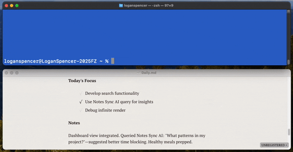
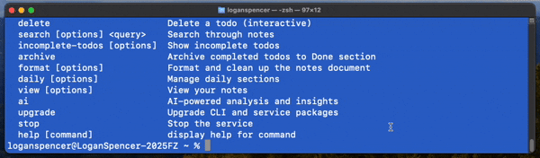

> ⚠️ **Alpha Status**: This project is in active development. [CONTRIBUTING](docs/CONTRIBUTING.md) welcomed!

# Welcome to Notes Sync! 📝✨

Hey, developer! Cozy up with your favorite editor and let Notes Sync transform your note-taking into a seamless, AI-enhanced adventure. Your notes live in **one simple Markdown file**—embracing simplicity. Everything in one place, synced effortlessly to Git by a background process with AI-powered insights. Ready to make note-taking a joy? Let’s dive in!


<p align="center">
  
</p>
<p align="center">Using Typora as Editor / Viewer</p>

[Get Started](#-get-started-in-3-steps) | [Key Features](#-key-features) | [See Limitations](#limitations)

### **✅ macOS (Fully Supported)** 
**❌ Linux (Not Supported)**
**❌ Windows (Not Supported)**

*Help us support new environments, check out [ISSUES](https://github.com/laspencer91/notes-sync/issues)*

## What’s Notes Sync?

Notes Sync is your personal note-taking sidekick, keeping all your notes in a single Markdown file for ultimate simplicity. It:

- **Auto-syncs** your Markdown file to GitHub with every save, preserving file history.
- **Adds AI magic** with daily quotes and smart insights.
- **Offers a unified CLI** for quick note and todo management wherever you are.
- **Keeps things tidy** with automatic formatting and auto-generated daily templates each morning.

Perfect for:

- Daily journals and task tracking in one file.
- Meeting notes synced across devices.
- Any Markdown notes you want backed up effortlessly.
- The service can be installed without the CLI for use in auto-syncing a `.md` git repository.

## 🚀 Get Started in 3 Steps

> 💡 **No built-in MD editor**: [Typora](https://typora.io/) is recommended for its beautiful rendering and hot reloading.

1. **Install the CLI**:

   ```bash
   npm install -g @notes-sync/cli
   ```

2. **Run the Setup Wizard**:

   ```bash
   notes-sync install
   ```

   This guides you through:

    - Choosing a notes directory (e.g., `~/Documents/DailyNotes`).
    - Picking or creating **one Markdown file** (e.g., `Notes.md`) for all your notes.
    - Setting up a Git repo for syncing.
    - Enabling optional AI features with a Gemini API key.

3. **Test It Out**:

   ```bash
   notes-sync status           # Check service
   notes-sync add -n "First note!"  # Add a note
   notes-sync view --today     # View today’s notes
   ```

That’s it! Your single Markdown file is now syncing, and you’re ready to roll.

## ✨ Why You’ll Love It

- **One File, All Notes**: Everything lives in a single Markdown file for simplicity and focus.
- **Auto-Sync to Git**: Saves and pushes your file to GitHub with smart, debounced commits.
- **Daily AI Quotes**: Personalized, motivational quotes based on your notes.
- **Unified CLI**: Interact with your `Notes.md` from wherever you are at with the CLI.
- **Interactive Todos**: Mark complete or delete tasks with simple menus.
- **Smart Search**: Find notes across days within your single file.
- **Auto-Daily Templates**: Fresh daily sections with Focus, Notes, Done, and Tomorrow.
- **Clean Formatting**: Keeps your Markdown file neat and consistent.

## 📦 What’s Inside?

Notes Sync is split into three npm packages:

- `@notes-sync/cli`: Your go-to CLI for note and todo commands.
- `@notes-sync/service`: Background server and file watcher for auto-sync.
- `@notes-sync/shared`: Shared TypeScript types and API client for smooth communication.

The CLI auto-detects the service, whether in dev or production mode, and guides you if setup is needed.

## 📖 Key Features

### Add Notes & Todos

```bash
notes-sync add -n "Great idea from standup"  # Appends to your freeflow notes section for today
notes-sync add -t "Finish project proposal"  # Adds to today’s todo checkboxes
```

### Manage Todos

```bash
notes-sync mark-complete    # Interactive completion
notes-sync delete           # Interactive deletion
notes-sync incomplete-todos # See pending tasks
notes-sync archive          # Move done tasks to Done
```

### Search Notes

```bash
notes-sync search "project alpha" --days 30  # Search your single file
```

### AI Insights

Ask your notes anything with Gemini-powered analysis:

<p align="center">
  
</p>

```bash
notes-sync ai query "What should I focus on next?"
notes-sync ai query --week "How productive was I?"
```

### Auto-Daily Sections

Each day adds a fresh section to your single Markdown file:

```markdown
# 8/14/2025
_Keep your focus sharp, one task at a time_ - AI Generated

**Today's Focus**
- [ ] Your tasks here

**Notes**
Freeflow text in any format you like here!

**Done**
The cli `archive` command will move completed tasks here!

**Tomorrow**
A section to track tomorrows tasks
```

### Format Like a Pro

```bash
notes-sync format           # Clean up your single file
notes-sync format --validate # Check for issues
```

## ⚙️ Configure It Your Way

Run `notes-sync install` for an interactive setup, or edit `~/.config/notes-sync/config.json`:

```json
{
  "notesDir": "~/Documents/DailyNotes",
  "notesFile": "Notes.md",
  "autoCreateDaily": true,
  "ai": {
    "enabled": true,
    "provider": "gemini",
    "apiKey": "your-gemini-api-key",
    "features": { "dailyQuotes": true }
  }
}
```

Get a free Gemini API key at [Google AI Studio](https://aistudio.google.com/).

## 📋 Daily Workflow

**Morning**:

```bash
notes-sync daily --status    # Check today’s section
notes-sync add -t "Plan sprint"  # Set goals
```

**Daytime**:

```bash
notes-sync add -n "Discussed API with team"  # Add to your file
notes-sync mark-complete     # Check off tasks
```

**Evening**:

```bash
notes-sync archive           # Clean up completed todos
notes-sync ai query --review # Reflect on progress
```

## 🛠️ Troubleshoot & Uninstall

**Service Issues**:

```bash
notes-sync status  # Check if running
notes-sync logs    # View logs
npm install -g @notes-sync/service  # Reinstall service
```

**Uninstall**:

```bash
notes-sync stop
notes-sync-service uninstall
npm uninstall -g @notes-sync/cli @notes-sync/service
rm -rf ~/.config/notes-sync
```

## Limitations

- While a directory of .md files can be synced to git, only one file can be managed by the CLI / Server HTTP.
- No built in UI for Markdown rendering. [Typora](https://typora.io/) is a great option with a clean interface and supports "hot reloading" by default.
- The template format is relatively strict, and not configurable at the time of writing. This would be an awesome feature to have in the future.

## 🌟 Glossary

- **Single File Simplicity**: All notes and todos live in one Markdown file for clarity and ease. See [Why You’ll Love It](#-why-youll-love-it).
- **Auto-Sync**: Commits and pushes your file to GitHub on save. Learn more [here](#-key-features).
- **AI Insights**: Contextual quotes and note analysis via Gemini. See [AI Insights](#-key-features).
- **Daily Templates**: Auto-created daily sections in your file. Check [Auto-Daily Sections](#-key-features).

## 🔮 Explore More

- [CLI Commands](#-key-features): Full command reference.
- [Development Guide](./docs/DEVELOPMENT.md): Build and extend Notes Sync.
- [Contributing](#-development): Add your own features.
- [License](#-development): MIT License details.

Notes Sync is your cozy, powerful companion for keeping all your notes in one Markdown file. Embrace simplicity, capture ideas, and let AI spark your productivity! 🚀
